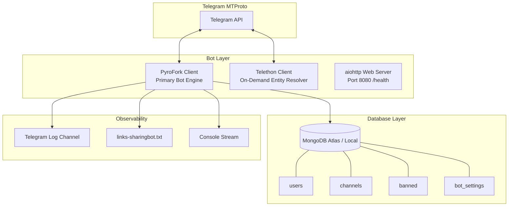
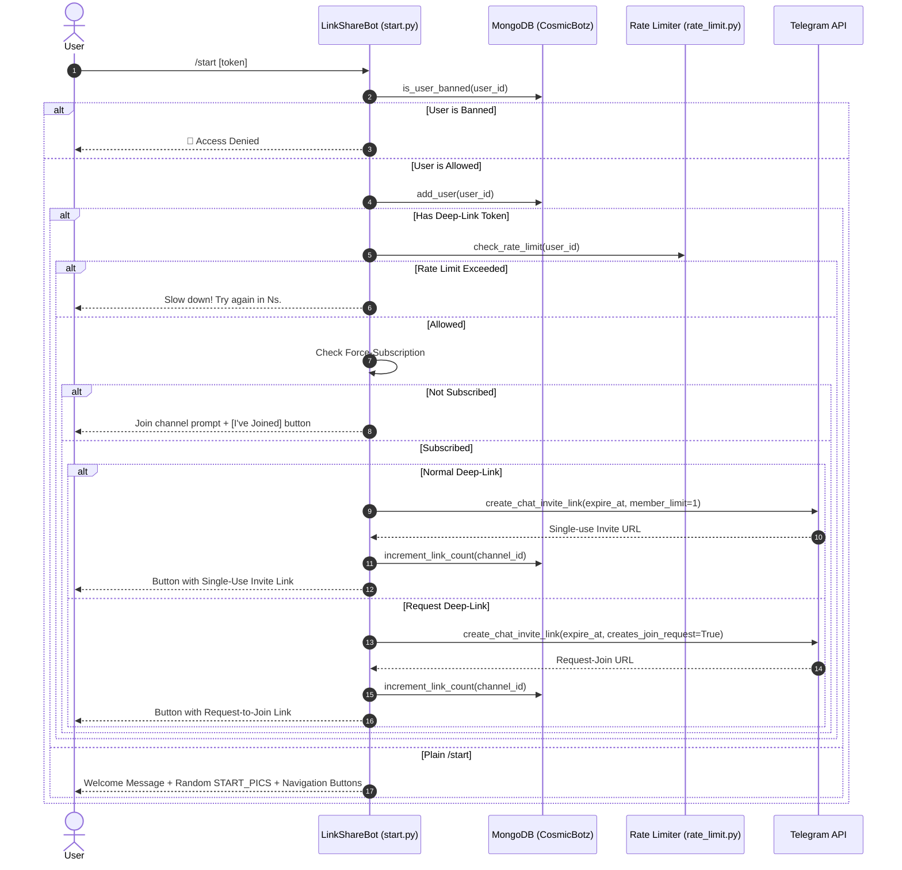
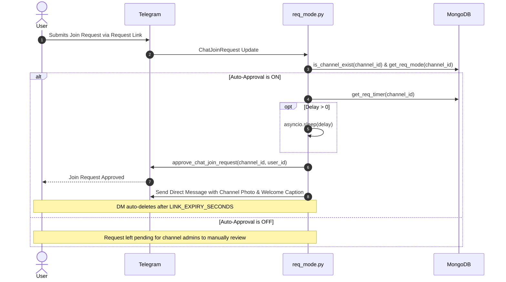

# 🌌 LinkShareBot — Architectural Specification & Operational Manual

> **Secure Telegram Private Channel Link Management & Auto-Approval Engine**  
> Built with **PyroFork (Pyrogram v2)** + **Telethon (On-Demand Entity Resolver)** + **MongoDB (Motor)** + **aiohttp**

---

## 1. Executive Summary & Core Philosophy

**LinkShareBot** solves the vulnerability of private Telegram channels leaking permanent invite links. When a private invite link is posted publicly, unauthorized users, bots, or channel scrapers can join or scrape the link indefinitely.

LinkShareBot acts as an intelligent intermediary:
1. **Never exposes permanent channel invite links.**
2. Generates **single-use ephemeral invite links** (`member_limit=1`) that expire automatically after a configurable time window (`LINK_EXPIRY_SECONDS`, default 5 minutes).
3. Generates **join-request links** (`creates_join_request=True`) paired with an automated approval engine that can immediately or conditionally approve users and send rich welcome notifications.
4. Enforces an optional **Force-Subscription Gate**, requiring users to join a sponsor channel before receiving their private link.
5. Employs a **dual-engine architecture**: PyroFork manages high-throughput async event loops and client handlers, while an on-demand Telethon bot client resolves arbitrary channels, usernames, and replied peers without standard Bot API limitations.

---

## 2. System Architecture



---

## 3. Repository Structure

```
Link-Share-Bot/
├── .gitignore              # Ignores bytecode, venv, sessions, logs, .env
├── Dockerfile              # Container definition (Python 3.11-slim)
├── Procfile                # Heroku / Dokku process launcher
├── README.md               # User quickstart and deployment overview
├── app.json                # Heroku / cloud deployment manifest with env schema
├── bot.py                  # Bot class (client lifecycle, startup/shutdown hooks, commands menu)
├── config.py               # Settings loader, env parsing, logger setup, send_log helper
├── helper_func.py          # Link generation, base64 tokens, pagination, subscription check
├── helper_telethon.py      # On-demand Telethon resolver for usernames, links & replied chats
├── main.py                 # Async entry point
├── project.md              # Complete bot architecture, command workflows & guides
├── rate_limit.py           # In-memory sliding-window request rate limiter
├── requirements.txt        # Python dependency manifest
├── database/
│   ├── __init__.py         # CosmicBotz database singleton export
│   └── mongodb.py          # Motor async MongoDB wrapper (users, channels, bans, settings)
└── plugins/
    ├── __init__.py         # Health-check web server (aiohttp)
    ├── admin.py            # Admin operations: /status, /users, /ban, /unban, /export, /restart, etc.
    ├── auto_remove.py      # Dynamic channel safety: prompts owner when bot is kicked/demoted
    ├── channel_mgmt.py     # Channel CRUD: /addch, /delch, /channels, /links, /reqlink, /bulklink
    ├── errors.py           # Global error interceptor and exception forwarding
    ├── pro_channels.py     # Auto-register on admin promotion; non-admin security containment
    ├── req_mode.py         # Join-request approval handler & rich notification delivery
    ├── settings.py         # Interactive in-Telegram /config panel for runtime adjustments
    ├── start.py            # Deep-link router, /start, /help, /about, force-sub verification
    └── utils.py            # Utilities: /ping, /myid, /id (dual-engine resolver), /top, /checkch
```

---

## 4. Complete Command Reference & Workflows

### 4.1. Public / User Commands

| Command | Arguments | Permission | Description |
|---|---|---|---|
| `/start` | `[token]` | Public | Starts the bot or resolves a single-use / request deep-link. |
| `/help` | None | Public | Displays instructions and available commands with inline navigation. |
| `/about` | None | Public | Displays information about the bot, version, framework, and maintainer. |
| `/ping` | None | Public | Measures internal bot response latency in milliseconds. |
| `/id` | `[@username \| ID \| link]` | Public | Unified ID tool: resolves caller's ID, replied message/channel, or target using PyroFork + Telethon. |

#### Detailed `/start [token]` Workflow


#### Detailed `/id` Dual-Engine Resolution Workflow
- **Mode 1 (`/id @target` or `/id <target_id>` or `/id <t.me/link>`)**:
  1. Tries PyroFork `client.get_users(target)`. If found, replies with user details and DC ID.
  2. If `PeerIdInvalid` or `UsernameInvalid`, tries PyroFork `client.get_chat(target)`. If found, replies with chat details.
  3. If PyroFork cannot resolve the entity, falls back to `helper_telethon.resolve_entity_info(target)`.
  4. Telethon resolves the peer via MTProto, extracting `peer_id`, `raw_id`, `title`, `username`, `type` (channel, supergroup, group, user), `dc_id`, and `restricted` status.
- **Mode 2 (Reply to message)**:
  1. If forwarded from a channel (`forward_from_chat`), displays channel title, ID, username, and type.
  2. If forwarded from a user (`forward_from`), displays user name, ID, and username.
  3. If forwarded with hidden author (`forward_sender_name`), informs user that privacy is enabled.
  4. If replied to a channel post (`sender_chat`), displays channel details.
  5. If replied to a regular user message (`from_user`), displays that user's info.
  6. If the replied message contains a `@username` or `t.me/` URL in text/caption, Telethon on-demand parses and resolves it.
- **Mode 3 (Plain `/id`)**:
  - Displays the caller's own ID, username, mention, and DC ID.

---

### 4.2. Channel Management Commands (Admins Only)

| Command | Arguments | Permission | Description |
|---|---|---|---|
| `/addch` | `<channel_id>` | Admin | Registers a channel in the bot database and generates initial links. |
| `/delch` | `<channel_id>` | Admin | Removes a channel from the database. |
| `/channels`| None | Admin | Paginated inline channel management panel (toggle auto-approve, get links, delete). |
| `/links` | None | Admin | Lists all normal single-use deep links for registered channels. |
| `/reqlink` | None | Admin | Lists all request-to-join deep links for registered channels. |
| `/bulklink`| `<id1> <id2>...`| Admin | Generates both Normal and Request deep-links for specified channel IDs. |
| `/checkch` | None | Admin | Checks bot admin rights and accessibility for all registered channels. |
| `/syncchannels`| None | Admin | Scans MongoDB for legacy channel records, normalizes IDs & syncs Telegram titles. |
| `/top` | None | Admin | Shows top 10 channels ranked by total generated links. |

---

### 4.3. Join Request & Auto-Approval Commands (Admins Only)

| Command | Arguments | Permission | Description |
|---|---|---|---|
| `/reqmode` | `<channel_id>` | Admin | Toggles automatic approval ON/OFF for a specific channel. |
| `/reqtime` | `[<channel_id>] <seconds>` | Admin | Sets approval delay in seconds (omitting channel sets global default). |
| `/approveon`| None | Admin | Enables automatic join request approval for all channels. |
| `/approveoff`| None | Admin | Disables automatic join request approval for all channels. |

#### Join Request Processing Workflow


---

### 4.4. Administration & Moderation Commands (Admins)

| Command | Arguments | Permission | Description |
|---|---|---|---|
| `/status` | None | Admin | Shows current bot uptime, user count, and channel count. |
| `/users` | None | Admin | Returns the total count of distinct users registered in MongoDB. |
| `/ban` | `<user_id \| reply> [reason]` | Admin | Bans a user from using the bot or generating links. |
| `/unban` | `<user_id \| reply>` | Admin | Lifts ban from a user. |
| `/banlist` | None | Admin | Shows paginated/formatted list of all banned users with reasons. |
| `/export` | None | Admin | Exports all registered channels and their configurations as a JSON file. |
| `/resetlinks`| `<channel_id \| all>` | Admin | Resets link generation counters for one channel or all channels. |
| `/restart` | None | Admin | Cleanly reloads the bot process and updates message on reboot. |

---

### 4.5. Owner-Only Commands

| Command | Arguments | Permission | Description |
|---|---|---|---|
| `/stats` | None | Owner | Detailed statistics: user count, channels count, total links generated, bans, uptime. |
| `/broadcast`| (Reply to message) | Owner/Admin | Broadcasts replied message to all users with live progress indicator. |
| `/cleanup` | None | Owner/Admin | Tests active communication with users and purges deactivated/blocked accounts. |
| `/logs` | None | Owner | Sends the latest `links-sharingbot.txt` log file as an attachment. |
| `/config` | None | Owner | Interactive settings panel to modify runtime settings without restarting (including DEPLOY_HOOK_URL). |
| `/update` | None | Owner | Universal update engine: triggers cloud redeploy webhook (Koyeb/Render) or performs conflict-free Git reset/pull & restart (VPS/Local). |

---

## 5. Security & Channel Pipeline Safeguards

### 5.1. Owner Direct Add vs. Admin Confirmation Workflow (`plugins/pro_channels.py`)
**Workflow Overview**:
1. **Owner Direct Add**:
   - When the bot is promoted to administrator in a channel by the `OWNER_ID`, it is registered immediately into MongoDB, deep-links (Normal and Request) are generated on the fly, and delivered directly to the Owner via DM and logged to `LOG_CHANNEL`.
2. **Admin Confirmation Gate**:
   - When the bot is promoted by an authorized admin (`ADMINS`):
     - If `ADMIN_DIRECT_ADD` is `False` (default safe mode): the bot does NOT register the channel immediately.
     - The bot sends an interactive DM to the promoting admin containing channel details and two buttons: `[✅ ᴄᴏɴꜰɪʀᴍ]` and `[❌ ɪɢɴᴏʀᴇ]`.
     - **Tapping Confirm**: Registers the channel in MongoDB, builds the invite links, updates the admin's DM message with live link buttons, and notifies the Owner and `LOG_CHANNEL`.
     - **Tapping Ignore**: Discards the channel addition without writing to MongoDB and marks the action cancelled.
     - If the admin has not started the bot (cannot receive DM), an alert is sent to the Owner and `LOG_CHANNEL` with manual `/addch` fallback instructions.
3. **Owner Config Control (`ADMIN_DIRECT_ADD`)**:
   - The Bot Owner can toggle this setting directly from the `/config` interactive settings panel:
     - Tapping the `❍ ᴀᴅᴍɪɴ ᴅɪʀᴇᴄᴛ ᴀᴅᴅ` button toggles between `[ ᴇɴᴀʙʟᴇᴅ ]` and `[ ᴅɪsᴀʙʟᴇᴅ ]` instantly without needing a restart.
     - Optional fallback via `.env`: `ADMIN_DIRECT_ADD=True/False`.

### 5.2. Non-Admin Channel Addition Containment
**Issue Solved**: Previously, if any random Telegram user added the bot as administrator to an arbitrary channel, `plugins/pro_channels.py` auto-registered the channel into MongoDB, generated links, and activated features for an untrusted channel.

**Current Pipeline Protection**:
1. When `on_bot_added_to_channel` fires (`ChatMemberUpdated`), the bot inspects `update.from_user`.
2. If `update.from_user.id not in ADMINS`:
   - The bot **remains in the channel** (does not abruptly quit).
   - **Skips DB registration** (`CosmicBotz.add_channel` is NOT called).
   - **Skips link generation** (no invite links are created or logged).
   - **Skips auto-approval**.
   - Sends a security notice to `OWNER_ID` and `LOG_CHANNEL` identifying the channel name, channel ID, and who added the bot.
   - An authorized admin can manually activate it later using `/addch <channel_id>` if desired.

### 5.2. Auto-Remove on Demotion / Kick
1. When the bot is demoted or banned from a registered channel (`plugins/auto_remove.py`), it prompts the owner in private message with inline buttons:
   - `[✅ Confirm Remove]`: Deletes the channel from MongoDB.
   - `[❌ Keep It]`: Retains the record in MongoDB.
2. If no response is received within 10 minutes, the prompt auto-expires safely without deleting the channel.

### 5.3. Legacy Database Migration & Channel Name Synchronization
**Problem Addressed**:
When migrating to LinkShareBot from an older or alternative repository fork:
- Channels in MongoDB were often stored with **string `_id` values** (e.g. `"_id": "-1001234567890"`), nested fields (`"chat_id"`, `"channel_id"`), or auto-generated MongoDB `ObjectId` string hashes (e.g. `68bhdhhdjh`).
- Channel titles were frequently stored as generic placeholders like `"Channel"`, `"Channel -100..."`, or empty strings.
- Because MongoDB distinguishes BSON types strictly (`int` vs `str`), standard Pyrogram queries like `find_one({"_id": int(cid)})` returned `None`, causing Telegram inline buttons to trigger `"Channel not found in DB"`.

**Resolution & Built-In Migration**:
1. **Multi-Type Query Filter (`_channel_filter`)**:
   Every database query in `database/mongodb.py` matches across integer IDs, string IDs, and nested `chat_id`/`channel_id` fields simultaneously:
   ```python
   {"$or": [{"_id": int_id}, {"_id": str_id}, {"chat_id": int_id}, ...]}
   ```
2. **Dynamic Live Name Refresh**:
   When opening channel info via `/channels` or clicking a channel, if the stored name is generic or hash-like, the bot calls `client.get_chat(channel_id)` live, updates MongoDB with the genuine Telegram channel title, and renders the real title instantly.
3. **Automated Startup Migration**:
   On bot boot (`bot.py`), an asynchronous background task (`CosmicBotz.migrate_and_normalize_channels(client)`) scans all legacy records, verifies them against Telegram MTProto, converts string/nested records into standard negative integer `_id` documents, updates their titles, and deletes legacy duplicate documents.
4. **Manual Sync Command & Inline Button**:
   Admins can run `/syncchannels` or tap `[🔄 sʏɴᴄ ᴀʟʟ ɴᴀᴍᴇs]` in the `/channels` menu to perform on-demand resynchronization with real-time stats (Scanned, Migrated, Titles Updated, Errors).
5. **100% Deep-Link Preservation**:
   All pre-existing base64/token invite links continue to resolve flawlessly because link token decoders look up channels using the multi-type filter.

---

## 6. Database Collections & Schema

### `users` Collection
```json
{
  "_id": 123456789,
  "joined": 1729000000
}
```

### `channels` Collection
```json
{
  "_id": -1001987654321,
  "name": "My Private Channel",
  "added": 1729000000,
  "req_mode": true,
  "req_timer": 0,
  "link_count": 142
}
```
*Special Document*: `_id: "__global__"` stores `{ "req_timer": 0 }` representing the global auto-approval default delay.

### `banned` Collection
```json
{
  "_id": 987654321,
  "reason": "Spamming link requests",
  "banned_by": 123456789,
  "banned_at": 1729001200
}
```

### `bot_settings` Collection
```json
{
  "_id": "LINK_EXPIRY_SECONDS",
  "value": 300
}
```

---

## 7. Logging & Observability

### Multi-Tier Log Architecture
1. **Console Stream**: Standard stdout stream with clean timestamps and module names.
2. **Rotating File Log**: `links-sharingbot.txt` (up to 50MB per file with 10 rotated backups). Downloadable via `/logs`.
3. **Telegram Log Channel (`LOG_CHANNEL`)**:
   - Bot startup status with active worker count.
   - Channel addition, deletion, and auto-registration events.
   - User bans and unbans.
   - Process restarts and deploy updates.
   - Unhandled exceptions with error previews.
4. **Library Noise Filter**: `pyrogram` and `telethon` internal logging is clamped to `WARNING` to prevent flood of session polling packets in the log file.

---

## 8. Configuration Reference

| Variable | Type | Required | Default | Description |
|---|---|---|---|---|
| `APP_ID` | Integer | **Yes** | — | Telegram App ID from [my.telegram.org](https://my.telegram.org). |
| `API_HASH` | String | **Yes** | — | Telegram API Hash from [my.telegram.org](https://my.telegram.org). |
| `TG_BOT_TOKEN` | String | **Yes** | — | Bot token from [@BotFather](https://t.me/BotFather). |
| `OWNER_ID` | Integer | **Yes** | — | Telegram User ID of the primary bot owner. |
| `ADMINS` | String | No | `""` | Space-separated list of secondary admin User IDs. |
| `DB_URL` | String | **Yes** | — | MongoDB connection URI (`mongodb+srv://...` or `mongodb://...`). |
| `DB_NAME` | String | No | `"LinkShareBot"` | MongoDB database name. |
| `TG_BOT_WORKERS` | Integer | No | `100` | Number of async worker tasks for PyroFork. |
| `PORT` | Integer | No | `8080` | Port for health-check web server. |
| `FORCE_SUB_CHANNEL`| Integer | No | `0` | Channel ID for mandatory subscription (0 = disabled). |
| `LINK_EXPIRY_SECONDS`| Integer| No | `300` | Expiration lifetime in seconds for generated invite links. |
| `LOG_CHANNEL` | Integer | No | `0` | Channel/Group ID to forward bot logs and security alerts (0 = disabled). |
| `DEPLOY_HOOK_URL` | String | No | `""` | Webhook URL to trigger host redeployment on `/update`. |
| `START_PICS` | String | No | `""` | Comma-separated image URLs for `/start` banner. |
| `START_TEXT` | String | No | `""` | Custom HTML start text (`{mention}` supported). |
| `HELP_TEXT` | String | No | `""` | Custom HTML help text. |
| `ABOUT_TEXT` | String | No | `""` | Custom HTML about text. |

---

## 9. Deployment Guide

### Option A: Cloud Platforms (Render, Koyeb, Railway)
1. Fork or push this repository to GitHub.
2. Create a **Web Service** or **Background Worker**.
3. Set the Environment Variables as listed above.
4. If hosting on Render Web Service, set the Health Check path to `/health`.
5. Copy your service's **Deploy Hook URL** into the `DEPLOY_HOOK_URL` environment variable so running `/update` in Telegram automatically triggers a fresh build and redeploy.

#### 🚀 Cloud & VPS Update Engine (`/update`)
- **Cloud Hosting (Koyeb, Render, Heroku, Railway)**:
  On cloud container platforms, containers have **ephemeral, isolated filesystems** and are rebuilt from GitHub. Running `/update` dispatches an authenticated HTTP POST request to your hosting platform's deploy webhook (`DEPLOY_HOOK_URL`, easily configured directly in `/config`). The cloud provider then automatically pulls the latest commit, builds the container, and switches traffic seamlessly without crash loops.
- **VPS & Local Deployments**:
  When `DEPLOY_HOOK_URL` is not set, the bot automatically switches to local Git management:
  1. Checks for system `git` and verifies the repository work tree.
  2. Detects the active branch (`Master` / `main`) and fetches remote commits.
  3. Previews incoming commits, then runs `git reset --hard origin/<branch>` to eliminate any local merge conflicts.
  4. Detects if `requirements.txt` was modified and automatically installs dependencies.
  5. Gracefully disconnects clients, saves restart state to `restart.json`, and restarts via `os.execl` to update the message once online.

### Option B: VPS (Ubuntu / Debian Systemd)
```bash
# 1. Clone repository
git clone https://github.com/CosmisBotz/Link-Share-Bot.git /opt/linksharebot
cd /opt/linksharebot

# 2. Virtual environment setup
python3 -m venv venv
source venv/bin/activate
pip install -U pip
pip install -r requirements.txt

# 3. Create .env file with your credentials
nano .env

# 4. Create systemd service
sudo nano /etc/systemd/system/linksharebot.service
```

```ini
[Unit]
Description=LinkShareBot Telegram Service
After=network.target

[Service]
Type=simple
User=root
WorkingDirectory=/opt/linksharebot
ExecStart=/opt/linksharebot/venv/bin/python main.py
Restart=always
RestartSec=5

[Install]
WantedBy=multi-user.target
```

```bash
sudo systemctl daemon-reload
sudo systemctl enable linksharebot
sudo systemctl start linksharebot
```

### Option C: Docker
```bash
# Build Docker image
docker build -t linksharebot .

# Run container with environment file
docker run -d --name linksharebot --env-file .env -p 8080:8080 linksharebot
```
